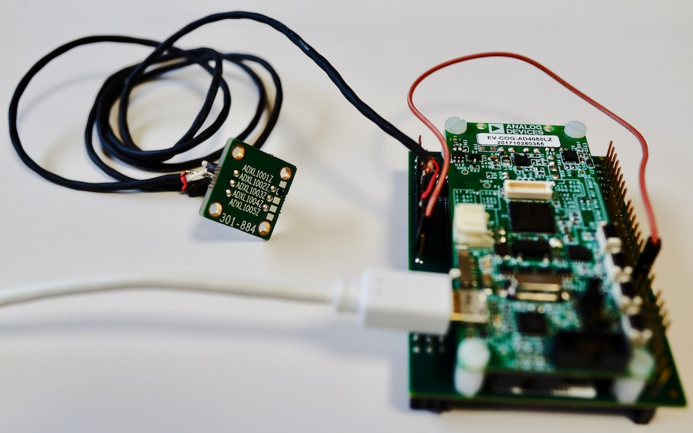

node-red-contrib-adxl100x-fft
===

[](https://github.com/CANDY-LINE/node-red-contrib-adxl100x-fft/releases/latest)
[](https://travis-ci.org/CANDY-LINE/node-red-contrib-adxl100x-fft/)

Node-RED nodes for Vibration Measurement using Analog Devices' [EVAL-ADXL100X Vibration Sensor Evaluation Board](http://www.analog.com/en/design-center/evaluation-hardware-and-software/evaluation-boards-kits/EVAL-ADXL100X.html) and [EV-COG-AD4050 ARM Cortex M4F MCU](http://www.analog.com/en/design-center/evaluation-hardware-and-software/evaluation-boards-kits/EV-COG-AD4050.html) with the special [firmware for FFT (Fast Fourier Transform)](https://www.analog.com/jp/landing-pages/003/form/jp_sensor_pv_vibration.html).



## Example Flow

The bundled example flow provides the following demonstrations:

- Show FFT value chart with FFT peak value refreshed every second on Dashboard
- Show FFT peak value (frequency and amplitude) on Dashboard

# Prerequisites

## Hardware

- [EVAL-ADXL1002Z](https://www.analog.com/jp/design-center/evaluation-hardware-and-software/evaluation-boards-kits/EVAL-ADXL100X.html#eb-buy) ... MEMS Accelerometers
- [EV-COG-AD4050LZ](https://www.analog.com/jp/design-center/evaluation-hardware-and-software/evaluation-boards-kits/EV-COG-AD4050.html#eb-buy) ... Microcontroller development board
- [EV-GEAR-EXPANDER1Z](https://www.analog.com/jp/design-center/evaluation-hardware-and-software/evaluation-boards-kits/EV-COG-AD4050.html#eb-buy) ...  Expansion board for bread boarding
- [2-conductor Shielded Cable](https://oyaide.com/catalog/products/2794.html)
- USB cable (Type A - microUSB) for connecting EVAL-ADXL1002Z board to Raspberry Pi

## Software

- Firmware for this node is available at [analog.com/jp](https://www.analog.com/jp/landing-pages/003/form/jp_sensor_pv_vibration.html). User registration is required.

## How to use

TBW

# How to install

## Node-RED users

Use `Manage Palette` dialog in the browser editor or run the following commands:
```
cd ~/.node-red
npm install node-red-contrib-adxl100x-fft
```

Then restart Node-RED process.

### Uninstallation

The following command uninstalls SmartMesh SDK python executables/libraries as well as this node package.

```
cd ~/.node-red
sudo npm uninstall --unsafe-perm node-red-contrib-adxl100x-fft
```

## CANDY RED users

Use `Manage Palette` dialog in the browser editor or run the following commands:
```
cd /opt/candy-red/.node-red
sudo npm install --unsafe-perm node-red-contrib-adxl100x-fft
```

Then restart `candy-red` service.

```
sudo systemctl restart candy-red
```

### Uninstallation

`Manage Palette` dialog should work for uninstallation as well as the following commands:

```
cd /opt/candy-red/.node-red
sudo npm uninstall --unsafe-perm node-red-contrib-adxl100x-fft
```

The above command uninstalls SmartMesh SDK python executables/libraries as well as this node package.

# Appendix

## How to build

```
# build
$ NODE_ENV=development npm run build
# package
$ NODE_ENV=development npm pack
```

# License

- Source Code ... ASL 2.0 ©CANDY LINE INC.
- Node Icon ... [CC BY-ND 3.0](https://creativecommons.org/licenses/by-nd/3.0/) © [icon8](https://icons8.com)

# Revision History

* 1.0.0
  - Initial Release
